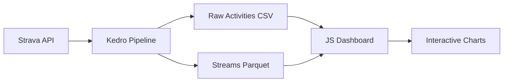

# Strava Analytics

A comprehensive data analytics platform for Strava activities, combining robust data collection with interactive visualizations.

## 📊 Project Overview

This project provides end-to-end analytics for Strava data, from intelligent API data collection to interactive web-based visualizations. Built with production-grade data pipelines and modern web technologies.

### 🏗️ Architecture

```
strava_analytics/
├── kedro-strava-analytics/    # Data collection & processing pipeline
│   ├── Smart API rate limiting
│   ├── Incremental data collection
│   ├── Streams enrichment (GPS, heart rate, power)
│   └── Production-ready error handling
└── js-visualisation/          # Interactive web dashboard
    ├── Real-time data visualization
    ├── Activity analysis charts
    └── Performance trend tracking
```

## 🚀 Features

### Data Collection Pipeline
- **Smart Rate Limiting**: Respects Strava's API limits with intelligent batching
- **Incremental Updates**: Only fetches new activities since last run
- **Streams Enrichment**: Detailed GPS, heart rate, power, and sensor data
- **Crash Recovery**: Automatic intermediate saves prevent data loss
- **Production Ready**: Comprehensive error handling and logging

### Interactive Dashboard
- **Real-time Visualization**: Dynamic charts and graphs
- **Activity Analysis**: Detailed breakdowns of performance metrics
- **Trend Tracking**: Long-term performance analysis
- **Responsive Design**: Works on desktop and mobile

## 🛠️ Quick Start

### 1. Data Collection Setup

```bash
cd kedro-strava-analytics

# Install dependencies
pip install -r requirements.txt

# Setup Strava API credentials (see STRAVA_SETUP.md)
python scripts/setup_strava_auth.py

# Collect historical data (first time)
kedro run --pipeline=day0

# Regular incremental updates
kedro run

# Add detailed streams data
kedro run --pipeline=streams
```

### 2. Visualization Dashboard

```bash
cd js-visualisation

# Install dependencies
npm install

# Start development server
npm start
```

## 📁 Project Components

### [kedro-strava-analytics/](./kedro-strava-analytics/)
**Data Collection & Processing Pipeline**

Production-grade Kedro pipeline for Strava data collection with:
- Intelligent API rate limiting and error handling
- Incremental data updates (only new activities)
- Rich streams data (GPS tracks, heart rate, power, etc.)
- Configurable processing parameters
- Comprehensive logging and monitoring

**Key Pipelines:**
- `day0`: Initial historical data collection
- `bau`: Regular incremental updates (default)
- `streams`: Detailed time-series data enrichment

### [js-visualisation/](./js-visualisation/)
**Interactive Web Dashboard**

Modern JavaScript dashboard for Strava data visualization featuring:
- Interactive charts and performance metrics
- Activity timeline and trend analysis
- Responsive design for all devices
- Real-time data updates

## 📊 Data Flow



1. **Collection**: Kedro pipeline fetches data from Strava API
2. **Processing**: Activities and streams data stored in optimized formats
3. **Visualization**: JavaScript dashboard loads data for interactive analysis

## 🔧 Configuration

### API Rate Limits
```yaml
# kedro-strava-analytics/conf/base/parameters.yml
api_rate_limit:
  max_requests_per_15_minutes: 95
  max_daily_requests: 950

streams_enrichment:
  rate_limit_delay: 1.0
  max_concurrent_requests: 10
  save_every_n_batches: 1  # Crash recovery frequency
```

### Data Sources
- **Activities**: Basic activity metadata (distance, time, type, etc.)
- **Streams**: Detailed time-series data (GPS, heart rate, power, cadence)
- **Storage**: CSV for activities, Parquet for streams (optimized compression)

## 🚦 Development Status

- ✅ **Data Collection**: Production-ready with comprehensive error handling
- ✅ **Incremental Updates**: Fully automated new activity detection
- ✅ **Streams Enrichment**: All sensor data types supported
- ✅ **Rate Limiting**: Smart batching respects API constraints
- 🔄 **Visualizations**: Interactive dashboard in development

## 📖 Documentation

- **[Setup Guide](./kedro-strava-analytics/STRAVA_SETUP.md)**: Strava API configuration
- **[Pipeline Guide](./kedro-strava-analytics/PIPELINE_GUIDE.md)**: Data collection workflows
- **[Streams Guide](./kedro-strava-analytics/STREAMS_GUIDE.md)**: Time-series data enrichment
- **[Development Guide](./kedro-strava-analytics/CLAUDE.md)**: Technical architecture

## 🤝 Contributing

This project uses production-grade patterns:
- **Type hints** throughout codebase
- **Comprehensive error handling** with structured logging
- **Rate limiting** and API best practices
- **Incremental processing** for efficiency
- **Modern Python** with Polars for high-performance data processing

## 📝 License

This project is for personal use and learning purposes. Strava API usage must comply with their terms of service.

---

**Built with:** Python, Kedro, Polars, JavaScript, Strava API